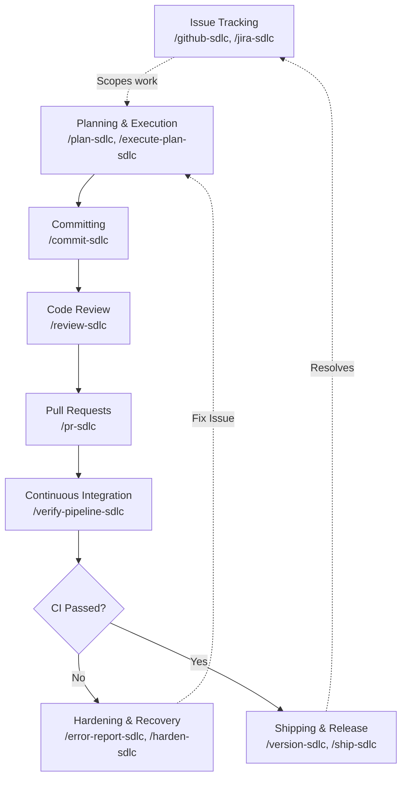

# LiftCD — Antigravity Agentic SDLC Plugin

> 🚀 **Native SDLC pipeline for Antigravity agents** — plan, commit, review, PR, ship, all from chat. Take work from issue to shipped release without leaving your editor.

[](LICENSE)

LiftCD is a comprehensive suite of skills and commands for Software Development Lifecycle (SDLC) workflows — planning, execution, commits, code review, pull requests, CI verification, and releases — that run natively inside Google Antigravity. It is an Antigravity-native, cross-platform (POSIX and Windows) rewrite inspired by [`rnagrodzki/sdlc-marketplace`](https://github.com/rnagrodzki/sdlc-marketplace), rebuilt as a flat, single plugin for the Antigravity platform.

## See It In Action

Writing code and managing your release lifecycle has never been simpler. With LiftCD, you can go from an issue to a Pull Request by calling dedicated skills directly:

> **You:** `/github-sdlc view issue #42`
> 
> **Antigravity:** *(Reads issue #42 "Implement OAuth2 login flow" using the GitHub CLI)*<br>
> I've retrieved the issue details. Let's start with a plan.
> 
> **You:** `/plan-sdlc`
>
> **Antigravity:** *(Generates architecture plan and saves it to `implementation_plan.md`)*<br>
> Here is the implementation plan for OAuth2. Does this look good?
>
> **You:** Looks perfect, go ahead. `/execute-plan-sdlc`
>
> **Antigravity:** *(Executes the plan, runs tests, and stages the files)*<br>
> OAuth2 flow implemented successfully!
>
> **You:** `/commit-sdlc`
>
> **Antigravity:** *(Analyzes staged files and commits)*<br>
> 📝 **Auto-generated Commit:** `feat(auth): implement OAuth2 login flow (#42)`
>
> **You:** `/pr-sdlc`
>
> **Antigravity:** *(Runs GitHub PR flow)*<br>
> 🚀 **Pull Request created!** The PR description has been automatically populated with the business context and linked to Issue #42.

## Installation

You can install this plugin either globally for all workspaces, or locally for a specific workspace.

### Global Installation (Recommended)

To make the plugin available in all your Antigravity workspaces, clone this repository into your global Antigravity plugins directory:

```bash
git clone https://github.com/dnichyparuk/liftcd.git ~/.gemini/config/plugins/sdlc
```

### Workspace Installation

To install the plugin only for a specific workspace, navigate to the root of your project and clone it into the local `.agents` directory:

```bash
mkdir -p .agents/plugins
git clone https://github.com/dnichyparuk/liftcd.git .agents/plugins/sdlc
```

> **Configuration note:** Permissions, plans directory, and other settings are documented in the [Appendix: Configuration](#appendix-configuration) section below.

## Quick Start

Once installed, the SDLC skills are automatically registered with your Antigravity agent and can be invoked from the chat interface. A few common entry points:

- `/commit-sdlc` — Commit staged changes
- `/pr-sdlc` — Create a pull request
- `/review-sdlc` — Review changes
- `/ship-sdlc` — Ship a release

See the [Skills Reference](#skills-reference) for the full catalog of 14 skills.

## SDLC Pipeline Structure

This plugin implements a complete, end-to-end Software Development Lifecycle process natively within the chat interface. The workflow is structured into the following distinct phases:



1. **Planning & Execution** (`/plan-sdlc`, `/execute-plan-sdlc`)
   - Scopes requirements, proposes architectural decisions, and breaks down the work into manageable tasks.
   - Executes the implementation plan systematically while adhering to guardrails.
2. **Committing** (`/commit-sdlc`)
   - Automatically generates smart, conventional commit messages by analyzing your staged diff and recent project history.
3. **Code Review** (`/review-sdlc`)
   - Performs a comprehensive, automated code review of your changes against predefined dimensions (e.g., security, architecture, performance) before you open a Pull Request.
4. **Pull Requests** (`/pr-sdlc`)
   - Generates detailed, well-structured PR descriptions based on the diff and commit history.
5. **Continuous Integration** (`/verify-pipeline-sdlc`)
   - Interfaces with GitHub Actions to monitor, verify, and diagnose CI/CD pipeline runs for your PRs.
6. **Hardening & Recovery** (`/error-report-sdlc`, `/harden-sdlc`)
   - If a pipeline fails or an error occurs, these skills analyze the failure to suggest stronger guardrails, preventing the same class of failure in the future.
7. **Shipping & Release** (`/version-sdlc`, `/ship-sdlc`)
   - Automates semantic versioning, changelog generation, and finalizing the release of the project.

## Skills Reference

The plugin exposes the following skills for managing your workflows:

| Skill | Model | Description |
|---|---|---|
| `/setup-sdlc` | flash-medium | Initializes guardrails, code review dimensions, and templates for a project. |
| `/plan-sdlc` | flash-medium | Scopes requirements and generates structured implementation plans. |
| `/execute-plan-sdlc` | flash-medium | Executes implementation plans systematically while adhering to guardrails. |
| `/commit-sdlc` | flash-medium | Generates smart, conventional commit messages and executes commits. |
| `/review-sdlc` | flash-medium | Performs automated code review against project-specific dimensions. |
| `/pr-sdlc` | flash-high | Generates descriptions and creates pull requests. |
| `/received-review-sdlc` | flash-high | Analyzes and processes code review feedback received on an open PR. |
| `/verify-pipeline-sdlc` | flash-high | Monitors and diagnoses CI/CD pipeline runs for your PRs. |
| `/version-sdlc` | flash-medium | Manages semantic versioning and changelog generation. |
| `/ship-sdlc` | flash-medium | Orchestrates the end-to-end shipping process (review, verify, merge, release). |
| `/error-report-sdlc` | flash-medium | Reports complex failures or plugin defects for tracking. |
| `/harden-sdlc` | flash-high | Analyzes pipeline failures to strengthen guardrails and prevent regressions. |
| `/github-sdlc` | flash-medium | Integrates with GitHub Issues for ticket tracking and updates. |
| `/jira-sdlc` | flash-medium | Integrates with Jira for ticket tracking and updates. |

## Agents Reference

Skills delegate isolated, context-clean subtasks to specialized agents. There are two categories:

### Registered Plugin Agents

These agents are defined in `agents/*.md` and dispatched via `sdlc:<name>`. They inherit no conversation context — all inputs arrive through a prepared manifest file.

| Agent | Dispatched by | Model | Role |
|---|---|---|---|
| **Plan explore orchestrator** | `/plan-sdlc` | flash-low | Derives 3–7 task-specific discovery dimensions and fans out parallel code/web/hybrid sub-agents to produce `discovery-brief.md`. |
| **Plan generation orchestrator** | `/plan-sdlc` | pro-high | Receives the exploration brief and writes the structured `implementation_plan.md` file. |
| **Plan execution validator** | `/execute-plan-sdlc` | pro-low | Validates plan integrity (circular deps, vague deliverables) and wave structure (file conflicts, risk clustering). Called twice per execution run. |
| **Commit orchestrator** | `/commit-sdlc` | flash-low | Reads the staged diff and commit history from a prepared manifest and returns a single, self-critiqued commit message string. |
| **Review orchestrator** | `/review-sdlc` | flash-low | Reads the review manifest, dispatches dimension sub-agents in parallel, deduplicates and critiques findings, and persists `review-comment.md`. |
| **Harden orchestrator** | `/harden-sdlc` | flash-low | Classifies a pipeline failure as `user-code`, `plugin-defect`, or `ambiguous`, then emits strengthen-only hardening proposals as JSON. |
| **Error report orchestrator** | `/error-report-sdlc` | flash-low | Fills the `ToolingError.md` issue template from a prepared manifest and returns `{title, body}` JSON for posting to the plugin tracker. |

### Ad-hoc Agents (prompt-template driven)

These agents have no file in `agents/` and are dispatched as `general-purpose` using inline prompt templates. They are implementation details of their parent agents.

| Agent | Model | Role |
|---|---|---|
| **Plan execution orchestrator** | flash-low (locked) | Executes one wave: fans out per-task coding agents in parallel, handles per-task retries with model escalation, and emits a bounded `WAVE_SUMMARY` token. |
| **Per-task coding agent** | flash (low/mid/high) / pro-low *(depends on complexity, retries and tier)* | Implements a single plan task: reads its fact sheet, writes files, runs verification, and returns a structured completion token. |
| **Review sub-agent** | Per-dimension override, default: flash-medium | Reviews the diff for one code review dimension and returns a structured findings list. |
| **Discovery sub-agent** | flash-low / flash-medium / pro-low (per dimension) | Explores code or web sources for one planning dimension and returns `F-<DIM>-<n>` tagged findings. |

> **Model escalation (coding agents):** On failure, the wave-runner escalates the task's model one tier per retry, up to 2 retries, along the fixed ladder `flash-low → flash-medium → flash-high → pro-low → pro-high`: `flash-low → flash-medium → flash-high`, `flash-medium → flash-high → pro-low`, `flash-high → pro-low → pro-high`, `pro-low → pro-high → pro-high + context`.

## Quality Modes (`/execute-plan-sdlc`)

When executing a plan, `/execute-plan-sdlc` asks you to select a **quality tier** that controls which model each coding agent runs on. The tier balances speed and cost against correctness.

> **Note on flag names:** The CLI flag values are counter-intuitively named. `--quality minimal` selects the *Speed* preset (cheapest), while `--quality full` selects the *Quality* preset (most capable).

### Tier Overview

Each task is classified as **Trivial**, **Standard**, or **Complex** based on scope. The tier maps that classification to a model:

| Flag | Display name | Use case | Trivial | Standard | Complex |
|---|---|---|---|---|---|
| `--quality minimal` | **Speed** | Fast iteration, drafts, low-stakes changes | flash-low | flash-medium | flash-high |
| `--quality balanced` | **Balanced** *(default)* | Everyday feature work — best cost/quality trade-off | flash-medium | flash-high | pro-low |
| `--quality full` | **Quality** | Architectural changes, high-risk tasks, production releases | flash-medium | pro-low | pro-high |

> **Trivial batching:** when 2 or more Trivial tasks land in the same wave they are batched into a single agent dispatch running at the tier's Trivial model (e.g. flash-medium in Balanced, flash-low in Speed). A lone Trivial task runs as an individual agent at the tier's Trivial model.

**Fixed-model agents (not affected by tier selection):**

| Agent | Model | Notes |
|---|---|---|
| **Plan execution orchestrator** | flash-low | Permanently locked — performs routing only. |
| **Spec compliance reviewer** | flash-high | **Skipped on Speed tier** and on trivial-only waves. |
| **Plan execution validator** | pro-low | Always pro-low. |

### Feature Differences by Tier

| Feature | Speed (`--quality minimal`) | Balanced | Quality (`--quality full`) |
|---|---|---|---|
| Per-wave spec compliance review | ❌ Skipped | ✅ After each non-trivial wave | ✅ After each non-trivial wave |
| Final cross-wave spec review | ❌ Skipped | ✅ When >3 waves or a per-wave issue found | ✅ When >3 waves or a per-wave issue found |
| Tier selection prompt | ✅ Shown (unless `--quality` passed) | ✅ | ✅ |
| Custom per-task model override | ✅ (`custom` option) | ✅ | ✅ |

### Retry Escalation Ladder

When a coding agent fails, the wave-runner escalates one model tier per retry (max 2 retries per task). Failure context is always added to the retry prompt.

| Starting model | Retry 1 | Retry 2 | After Retry 2 |
|---|---|---|---|
| flash-low | flash-medium | flash-high | FAILED → user |
| flash-medium | flash-high | pro-low | FAILED → user |
| flash-high | pro-low | pro-high | FAILED → user |
| pro-low | pro-high | pro-high + failure context | FAILED → user |
| pro-high | pro-high + failure context | — | FAILED → user |

> **Partial batch failure:** if a batch of Trivial tasks partially fails, only the failed tasks are re-dispatched individually with escalation. Completed tasks in the batch are final.

### Usage Examples

```bash
# Fastest — skip quality prompt and use Speed preset
/execute-plan-sdlc --quality minimal

# Default — Balanced (can also omit --quality and select interactively)
/execute-plan-sdlc --quality balanced

# Maximum correctness for architectural or high-risk work
/execute-plan-sdlc --quality full

# ship-sdlc forwards --quality when explicitly passed
/ship-sdlc --quality full
```

> **Custom override:** selecting `custom` at the interactive prompt lets you override the model for individual tasks before execution begins. Legacy aliases `A` (minimal/Speed), `B` (balanced), `C` (full/Quality) are accepted and normalised automatically.

## Model Legend

| Token | Full model name |
|---|---|
| flash-low | Gemini 3.5 Flash Low |
| flash-medium | Gemini 3.5 Flash Medium |
| flash-high | Gemini 3.5 Flash High |
| pro-low | Gemini 3.1 Pro Low |
| pro-high | Gemini 3.1 Pro High |

---

## Contributing

Contributions are welcome! Whether you're fixing a bug, improving documentation, or proposing a new skill, we'd love your help making LiftCD better.

- **Report issues:** Found a bug or have a feature idea? [Open an issue](https://github.com/dnichyparuk/liftcd/issues) and describe it as clearly as you can.
- **Submit changes:** Fork the repository, create a feature branch, and open a pull request. Keep changes focused and reference any related issue.
- **Dogfood the workflow:** This plugin implements a complete SDLC pipeline — feel free to use the LiftCD skills (`/plan-sdlc`, `/commit-sdlc`, `/pr-sdlc`, and friends) to author your own contributions.
- **Be respectful:** Please keep discussions constructive and welcoming to contributors of all experience levels.

Thanks for helping improve LiftCD!

---

## License

LiftCD is released under the [MIT License](LICENSE), the same license as the [`rnagrodzki/sdlc-marketplace`](https://github.com/rnagrodzki/sdlc-marketplace) project it was inspired by. The upstream license at the time this work was derived is pinned at commit [`f0e3afc`](https://github.com/rnagrodzki/sdlc-marketplace/blob/f0e3afc219e6b9d53b840ff4051b4befbd14778c/LICENSE). See the [LICENSE](LICENSE) file for full terms.

---

## Appendix: Configuration

### Permissions

LiftCD runs internal helper scripts — Node.js utilities under the plugin's root `scripts/` folder and POSIX shell wrappers under `skills/<skill>/scripts/` — for planning, validation, and telemetry. Each invocation is a terminal `command`, so by default Antigravity prompts before running them. You can pre-approve them by adding `command(...)` rules to your **Allow** list.

Antigravity evaluates every sensitive operation as an `action(target)` resource across three lists, in strict priority **Deny > Ask > Allow** (see the [official Permissions docs](https://antigravity.google/docs/permissions)). For `command(...)`, each whitespace-separated token is matched as an *anchored* regex and the rule matches by token **prefix**, so trailing arguments are covered automatically. On Windows, Antigravity normalizes paths before matching (drive letter stripped, `\` → `/`), so the forward-slash rules below work cross-platform.

> Scope the rules to the plugin's **install directory name** (`sdlc`, per the Installation steps above) — that is the path that appears in the executed command, *not* the plugin's internal manifest name (`liftcd`). Scoping to `sdlc` also avoids auto-approving unrelated plugins.

#### Antigravity 2.0 (IDE)

The IDE manages permissions through its UI. Open **Settings → Global Permissions** (or a Project's **Permissions**) and add the entries that match where you installed the plugin to the **Allow** list:

```text
# Global install (~/.gemini/config/plugins/sdlc)
command(node .*/\.gemini/config/plugins/sdlc/.*)              # Node helper scripts
command(.*/\.gemini/config/plugins/sdlc/skills/.*/scripts/.*) # Shell wrapper scripts

# Workspace install (.agents/plugins/sdlc or _agents/plugins/sdlc)
command(node .*/[._]agents/plugins/sdlc/.*)
command(.*/[._]agents/plugins/sdlc/skills/.*/scripts/.*)
```

You can also simply click **Allow** on the first permission card for each script; Antigravity caches the grant for subsequent identical invocations.

#### Antigravity CLI

If you drive LiftCD through the Antigravity CLI instead of the IDE, place the same grants in the CLI settings file under `permissions.allow`. The plugin reads `plansDirectory` from `~/.gemini/antigravity-cli/settings.json`, which is the most likely location — verify the exact path/schema for your CLI version:

```json
{
  "permissions": {
    "allow": [
      "command(node .*/\\.gemini/config/plugins/sdlc/.*)",
      "command(.*/\\.gemini/config/plugins/sdlc/skills/.*/scripts/.*)"
    ]
  }
}
```

### Plans Directory

By default, when you run `/plan-sdlc` in Normal Mode (not in an active plan session), the plugin writes your generated implementation plans to your home directory under `~/.gemini/plans/`. Since this path is outside your project workspace, it will trigger a permission prompt in the Antigravity sandbox.

You can configure a custom location for your plans either globally or locally for a specific repository using the `plansDirectory` setting in `settings.json`.

#### Global Configuration

To save plans to a custom directory for all projects, edit `~/.gemini/antigravity-cli/settings.json`:

```json
{
  "plansDirectory": "/absolute/path/to/your/global/plans"
}
```

#### Project-Specific Configuration

To save plans to a folder within a specific project (such as inside the `.sdlc` folder), create or edit `<project-root>/.gemini/antigravity-cli/settings.json`. Relative paths configured here resolve from the project root:

```json
{
  "plansDirectory": ".sdlc/plans"
}
```

The plugin automatically creates the directory structure if it does not already exist.
