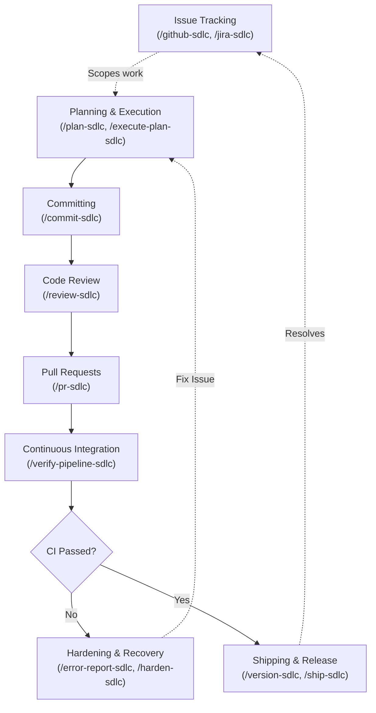

# Antigravity Agentic SDLC Plugin

This plugin provides a comprehensive suite of skills and commands for Software Development Lifecycle (SDLC) workflows (pull requests, code reviews, releases) within Google Antigravity. It is a cross-platform port (POSIX and Windows) of the Claude Code SDLC plugin built on the basis of https://rnagrodzki.github.io/sdlc-marketplace/.

## Installation

You can install this plugin either globally for all workspaces, or locally for a specific workspace.

### Global Installation (Recommended)

To make the plugin available in all your Antigravity workspaces, clone this repository into your global Antigravity plugins directory:

```bash
git clone https://github.com/dnichyparuk/antigravity-sdlc.git ~/.gemini/config/plugins/sdlc
```

### Workspace Installation

To install the plugin only for a specific workspace, navigate to the root of your project and clone it into the local `.agents` directory:

```bash
mkdir -p .agents/plugins
git clone https://github.com/dnichyparuk/antigravity-sdlc.git .agents/plugins/sdlc
```

## Usage

Once installed, the SDLC skills will be automatically registered with your Antigravity agent. You can invoke them via the chat interface, for example:

- `/commit-sdlc` - Commit staged changes
- `/pr-sdlc` - Create a pull request
- `/review-sdlc` - Review changes
- `/ship-sdlc` - Ship a release

## 🚀 See It In Action

Writing code and managing your release lifecycle has never been simpler. With the SDLC plugin, you can go from an issue to a Pull Request by calling dedicated skills directly:

> **You:** `/github-sdlc view issue #42`
> 
> **Antigravity:** *(Reads issue #42 "Implement OAuth2 login flow" using the GitHub CLI)*<br>
> I've retrieved the issue details. Let's start with a plan.
> 
> **You:** `/plan-sdlc`
>
> **Antigravity:** *(Generates architecture plan and saves it to `implementation_plan.md`)*<br>
> Here is the implementation plan for OAuth2. Does this look good?
>
> **You:** Looks perfect, go ahead. `/execute-plan-sdlc`
>
> **Antigravity:** *(Executes the plan, runs tests, and stages the files)*<br>
> OAuth2 flow implemented successfully!
>
> **You:** `/commit-sdlc`
>
> **Antigravity:** *(Analyzes staged files and commits)*<br>
> 📝 **Auto-generated Commit:** `feat(auth): implement OAuth2 login flow (#42)`
>
> **You:** `/pr-sdlc`
>
> **Antigravity:** *(Runs GitHub PR flow)*<br>
> 🚀 **Pull Request created!** The PR description has been automatically populated with the business context and linked to Issue #42.

## SDLC Pipeline Structure

This plugin implements a complete, end-to-end Software Development Lifecycle process natively within the chat interface. The workflow is structured into the following distinct phases:



1. **Planning & Execution** (`/plan-sdlc`, `/execute-plan-sdlc`)
   - Scopes requirements, proposes architectural decisions, and breaks down the work into manageable tasks.
   - Executes the implementation plan systematically while adhering to guardrails.
2. **Committing** (`/commit-sdlc`)
   - Automatically generates smart, conventional commit messages by analyzing your staged diff and recent project history.
3. **Code Review** (`/review-sdlc`)
   - Performs a comprehensive, automated code review of your changes against predefined dimensions (e.g., security, architecture, performance) before you open a Pull Request.
4. **Pull Requests** (`/pr-sdlc`)
   - Generates detailed, well-structured PR descriptions based on the diff and commit history.
5. **Continuous Integration** (`/verify-pipeline-sdlc`)
   - Interfaces with GitHub Actions to monitor, verify, and diagnose CI/CD pipeline runs for your PRs.
6. **Hardening & Recovery** (`/error-report-sdlc`, `/harden-sdlc`)
   - If a pipeline fails or an error occurs, these skills analyze the failure to suggest stronger guardrails, preventing the same class of failure in the future.
7. **Shipping & Release** (`/version-sdlc`, `/ship-sdlc`)
   - Automates semantic versioning, changelog generation, and finalizing the release of the project.

## Skills Reference

The plugin exposes the following skills for managing your workflows:

| Skill | Description |
|---|---|
| `/setup-sdlc` | Initializes guardrails, code review dimensions, and templates for a project. |
| `/plan-sdlc` | Scopes requirements and generates structured implementation plans. |
| `/execute-plan-sdlc` | Executes implementation plans systematically while adhering to guardrails. |
| `/commit-sdlc` | Generates smart, conventional commit messages and executes commits. |
| `/review-sdlc` | Performs automated code review against project-specific dimensions. |
| `/pr-sdlc` | Generates descriptions and creates pull requests. |
| `/received-review-sdlc` | Analyzes and processes code review feedback received on an open PR. |
| `/verify-pipeline-sdlc` | Monitors and diagnoses CI/CD pipeline runs for your PRs. |
| `/version-sdlc` | Manages semantic versioning and changelog generation. |
| `/ship-sdlc` | Orchestrates the end-to-end shipping process (review, verify, merge, release). |
| `/error-report-sdlc` | Reports complex failures or plugin defects for tracking. |
| `/harden-sdlc` | Analyzes pipeline failures to strengthen guardrails and prevent regressions. |
| `/github-sdlc` | Integrates with GitHub Issues for ticket tracking and updates. |
| `/jira-sdlc` | Integrates with Jira for ticket tracking and updates. |

