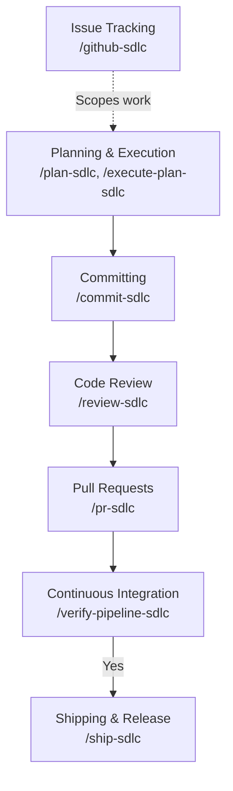
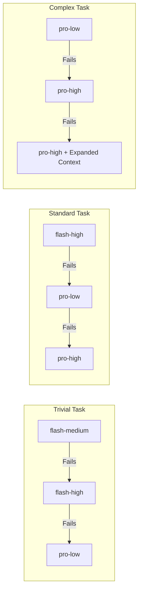

# Don't Just Vibe Code with Antigravity - Deliver with LiftCD

There’s a phrase that’s been floating around the developer community lately: **"Vibe Coding."** Popularized by AI luminaries, it describes the magical feeling of writing software by simply telling an AI what you want. You don't wrestle with boilerplate; you just sit back, direct the flow, and watch the system generate logic at the speed of thought. 

On Day 0—when you’re scaffolding a new app, hacking together a weekend project, or exploring a new framework—vibe coding is intoxicating. 

But what happens on Day 1?

When the prototype needs to become a production-ready system, the vibe often comes to a grinding halt. You hit a wall of metadata and process: writing unit tests, structuring clean commits, waiting for CI/CD pipelines, debugging obscure linter errors, and managing code reviews. Suddenly, your AI assistant feels less like a co-pilot and more like an eager intern who writes fast code but leaves you to do all the paperwork.

**What if your AI didn't just write code, but actually *delivered* software?**

This is the reality of transitioning to an **Agentic SDLC (Software Development Life Cycle)**—where AI agents autonomously manage the entire lifecycle loop.

Here is how I automated my developer workflow—achieving **zero context-switching** and **drastically reducing manual toil**—using [LiftCD](https://github.com/dnichyparuk/liftcd) (a powerful cross-platform fork of the tools detailed at the [SDLC Marketplace](https://rnagrodzki.github.io/sdlc-marketplace)).

---

## The Paradigm Shift: From Architect to Gardener

Traditional software engineering forces developers into the role of an **Architect**. You dictate every minute detail, every variable declaration, and every test case. AI coding assistants made this faster, but you were still the architect—just with a powerful autocomplete.

Agentic SDLC requires a shift to the **Gardener** mindset. As a gardener, you cultivate an environment. You define the "why" (business logic, architecture goals, constraints) and let the system figure out the "how." You don't micromanage the execution; you prune, guide, and review.

This is exactly what LiftCD aims to achieve. It takes the conversational interface you already use and wires it directly into the rigorous demands of enterprise software delivery.

## 1. The Building Blocks: Modular Skills

Instead of relying on a single, massive prompt to "build the app," the plugin exposes specialized **Skills** (accessible via terminal slash commands) that act as individual agents for specific tasks. 

- **Planning & Execution**
  - `/plan-sdlc`: Analyzes requirements and generates a structured, multi-step implementation plan.
  - `/execute-plan-sdlc`: Systematically executes the approved plan in parallel waves, ensuring all dependencies are respected.
- **GitOps & Delivery**
  - `/commit-sdlc`: Analyzes staged diffs to automatically generate smart, conventional commit messages.
  - `/pr-sdlc`: Generates rich PR descriptions based on commit history and diffs, linking back to your issue tracker.
- **Quality & Review**
  - `/review-sdlc`: Performs an automated, multi-dimensional code review before a PR is opened.
- **The Ultimate Orchestrator**
  - `/ship-sdlc`: A massive orchestration pipeline that strings the above skills together.

---

## 2. The Macro Workflow: From Issue to PR in One Command

These skills are powerful on their own, but their true value emerges when chained into an automated workflow designed to shepherd a ticket from ideation to release seamlessly:

**The Director Workflow**
Instead of manually typing out every sub-command, you can let the flagship `/ship-sdlc` pipeline handle the entire loop automatically. Here is what it looks like when you act strictly as the "Director":

> **You:** `/github-sdlc view issue #42`
> **Antigravity:** *(Reads issue #42)* Let's start with a plan.
> **You:** `/plan-sdlc`
> **Antigravity:** *(Generates architecture plan)* Does this look good?
> **You:** Looks perfect. `/ship-sdlc --quality balanced`
> **Antigravity:** *(Autonomously executes the plan in parallel waves, commits the code, runs internal review, fixes any caught issues, and opens the PR!)*
> 🚀 **Pull Request created!**

---

## 2. Spec-Driven Planning & Validation

Vibe coding often results in AI losing the plot on complex projects because it forgets the original requirements. A standout feature of this ecosystem is its deep integration with **OpenSpec**—a framework for managing software specifications as code. 

By running `/plan-sdlc --from-openspec oauth-flow`, the AI automatically cross-references your product documentation with the existing architecture to derive a low-level implementation plan. This creates a bulletproof traceability link between high-level business logic and AI execution.

### Under the Hood: The Planning Engine
What makes this different from a standard chat prompt is its rigorous internal checks and balances. 
When you request a feature, the `plan-generation-orchestrator` strictly decomposes the work, ensuring no single task touches more than 5 files, and assigns a complexity tag (*Trivial*, *Standard*, *Complex*) to each task. 

Before any code is written, a separate `plan-execution-validator` agent critiques the plan in two phases:
1. **Plan Integrity**: Checks for vague deliverables and circular dependencies.
2. **Wave Integrity**: Scans for "file conflicts" across parallel execution waves and ensures high-risk tasks aren't dangerously clustered together.

---

## 3. Autonomous Code Review & Self-Healing

The SDLC plugin doesn't just write code; it scrutinizes it.

### Under the Hood: The Multi-Dimensional Reviewer
Instead of using one massive prompt to review your code, the `/review-sdlc` orchestrator dispatches multiple specialized sub-agents in parallel (e.g., one focusing purely on Security, another on Performance). Once they return, the orchestrator runs a rigorous Deduplication and Critique phase—merging conflicting advice and correcting overblown severities—before producing a consolidated, deterministic verdict (e.g., `APPROVED WITH NOTES` or `CHANGES REQUESTED`).

### The Self-Healing Loop (`/received-review-sdlc`)
When the AI receives code review feedback from a human or an automated pipeline, it doesn't just blindly apologize and rewrite code. 

It verifies the reviewer's claims against the *full codebase context* (tracing callers and dependents, not just reading the diff). It then runs a dual-layer internal self-critique loop to ensure it doesn't engage in "performative agreement." If a human reviewer suggests a change that is factually incorrect or breaks an architectural constraint, the AI will respectfully push back with technical evidence rather than breaking the code to please the reviewer. 

---

## 4. Cost Management: Dynamic Model Routing

A major concern with agentic workflows is API cost. Having a high-tier reasoning model write a complex architecture plan makes sense, but using that same expensive model to generate a simple commit message or fix a typo is a massive waste of resources.

LiftCD solves this through **Dynamic Model Routing**. It automatically categorizes each task based on scope and routes it according to your selected quality tier. 

Here is how the default "Balanced" tier maps task complexity to specific models:

| Task Complexity | AI Model Assigned | Use Case Example |
|---|---|---|
| **Trivial** | `flash-medium` | Fixing a typo, updating a README |
| **Standard** | `flash-high` | Building a standard UI component |
| **Complex** | `pro-low` / `pro-high` | Implementing core business logic |
| **Orchestration**| `flash-low` | Wave Runner managing parallel agents |

*(Note: The plugin even automatically batches multiple Trivial tasks together into a single ultra-cheap `flash-low` run).*

### Automated Model Escalation
But what happens if a cheaper model struggles with a task? The plugin features a built-in safety net: **Model Escalation**. 

If a coding agent fails to complete its assigned task (e.g., tests fail or syntax is broken), the orchestrator automatically retries the task while escalating the model to the next tier of intelligence. 

This creates a highly efficient "try cheap first, escalate if needed" loop. You only pay for premium reasoning when the code proves it actually needs it.

---

## The Future of the Developer Workflow

By transitioning to this automated SDLC workflow, you gain several immediate benefits:
1. **Zero Context-Switching**: Manage everything from issue planning to CI verification right inside your terminal or editor chat.
2. **Automated Quality Control**: The AI reviews its own code against defined dimensions before a human ever has to look at it.
3. **Traceability**: With OpenSpec integration, the final code is provably linked to the original product specs.
4. **Drastic Reduction in Toil**: No more writing boilerplate commit messages, PR descriptions, or changelogs.

Vibe coding proved that AI can write syntax. Agentic SDLC proves that AI can deliver software. By automating the connective tissue of the development lifecycle, we elevate the developer's role from a code typist to a system director. The AI handles the boilerplate, the commits, and the reviews, leaving you to focus on the one thing algorithms still can't do: **decide what to build next.**

Ready to step beyond vibe coding? Check out [LiftCD on GitHub](https://github.com/dnichyparuk/liftcd) and explore the core concepts at the [SDLC Marketplace](https://rnagrodzki.github.io/sdlc-marketplace). 

*Try it out, star the repository, and let me know how it changes your workflow!*

***

***Disclaimer:** LiftCD is currently in active development and an early preview state. While it is fully functional and handles the planning, execution, and release workflows described in this article, it is evolving rapidly. We welcome feedback, bug reports, and contributions on the [GitHub repository](https://github.com/dnichyparuk/liftcd)!*
