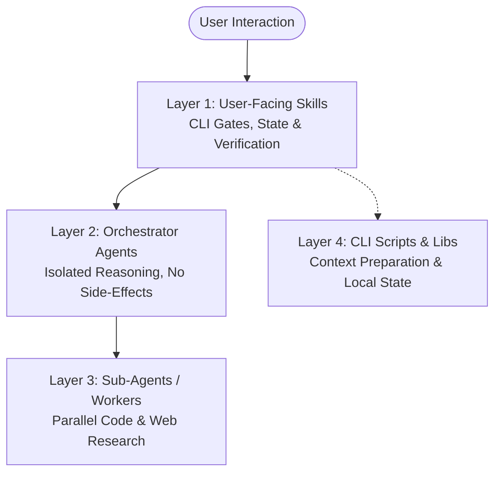

# SDLC Plugin Architecture & Agents Relation Report

This document provides a comprehensive analysis of the architecture, agent structure, inter-component relations, and model routing strategy within the Antigravity Agentic SDLC Plugin.

---

## 1. Architectural Overview

The SDLC plugin is structured as a hierarchical multi-agent system designed to isolate heavy context processing from the main user-facing chat session. It splits responsibilities into four distinct layers:

### Layer 1: User-Facing Skills (Main Context)
User-invocable commands (e.g., `/ship-sdlc`, `/plan-sdlc`, `/commit-sdlc`) that run directly in the user's primary conversation.
* **Responsibilities:** Interactive menus, safety check gates, compiling/running tests, committing staged files, pushing to Git, and executing CLI tools (such as `gh`).
* **Isolation Strategy:** Skills delegating heavy analysis task-by-task to **Layer 2** via the `Agent` tool. This keeps the main chat transcript thin, avoiding context limit issues on long sessions.

### Layer 2: Orchestrator Agents (Isolated Context)
Orchestrators (e.g., `commit-orchestrator`, `review-orchestrator`) defined via Markdown files in `agents/`.
* **Responsibilities:** Pure reasoning over serialized manifests. They read structured context, perform self-critique loops, and return clean JSON or plain-text strings.
* **Hard Constraints:** Orchestrator agents cannot call Git, write files (with minor exceptions for output briefs), invoke external CLIs, or inherit the parent conversation transcript.

### Layer 3: Sub-Agents & Workers
Specialized tasks dispatched in parallel by orchestrator agents or orchestrator skills.
* **Examples:** Plan critique lanes (e.g., `lane-guardrail-compliance`), planning lens reviewers, and parallel code-review dimension checkers.
* **Responsibilities:** Scanning files, searching the web, or validating requirements concurrently, reporting structured findings back to their parent orchestrator.

### Layer 4: CLI Scripts & Libraries
Programmatic helper scripts (written in Node.js/Bash) invoked by the main skills to serialize git history, calculate token budgets, and track state.
* **Key Modules:** [state.js](file:///home/dzmitry/.gemini/config/plugins/sdlc/scripts/lib/state.js) for state management and [dispatch-budget.js](file:///home/dzmitry/.gemini/config/plugins/sdlc/scripts/lib/dispatch-budget.js) for context constraints.

---

## 2. Component Relations & Interaction Flow

The following Mermaid diagram details the agent-to-agent and skill-to-agent trigger and consumption tree. Solid lines represent triggers/dispatches (often carrying CLI flags or manifest JSON paths), while dashed lines represent the returned results consumed by the calling parent.

```mermaid
flowchart TD
    %% Layer 1 Nodes (Skills)
    Ship["ship-sdlc (Skill)"]
    Plan["plan-sdlc (Skill)"]
    Exec["execute-plan-sdlc (Skill)"]
    Commit["commit-sdlc (Skill)"]
    Review["review-sdlc (Skill)"]
    RecvReview["received-review-sdlc (Skill)"]
    Harden["harden-sdlc (Skill)"]
    ErrReport["error-report-sdlc (Skill)"]
    
    %% Inline Scripts (Helper CLI)
    VerifyPipe["verify-pipeline (CLI Script)"]
    AwaitRemote["await-remote-review (CLI Script)"]

    %% Layer 2 Nodes (Orchestrators)
    PlanOrch["plan-explore-orchestrator (Agent)"]
    CommitOrch["commit-orchestrator (Agent)"]
    ReviewOrch["review-orchestrator (Agent)"]
    HardenOrch["harden-orchestrator (Agent)"]
    ErrorOrch["error-report-orchestrator (Agent)"]

    %% Layer 3 Nodes (Subagents / Workers)
    Lanes["Plan Critique Lanes (Agents)"]
    Lenses["Plan Lens Reviewers (Agents)"]
    WaveRunner["wave-runner (Agent)"]
    TaskAgent["Per-Task / Batch Task (Agents)"]
    DimReview["Dimension Reviewers (Agents)"]
    VerifyAgent["verify-pipeline-sdlc (Agent)"]
    Explorer["Code/Web Subagents"]

    %% --- Ship Pipeline Execution ---
    Ship -->|Triggers: --quality, --resume| Exec
    Exec -.->|Consumes: Wave success state & files modified| Ship

    Ship -->|Triggers: --auto| Commit
    Commit -.->|Consumes: Commit confirmation / status| Ship

    Ship -->|Triggers: --committed| Review
    Review -.->|Consumes: review-comment.md path| Ship

    Ship -->|Triggers inline execution| VerifyPipe
    VerifyPipe -->|Triggers on CI failure| VerifyAgent
    VerifyAgent -->|Triggers fix commit| Commit
    
    Ship -->|Triggers inline execution| AwaitRemote
    AwaitRemote -->|Triggers on actionable verdict| RecvReview
    RecvReview -->|Triggers fix commit| Commit

    %% --- Plan Scoping & Critique ---
    Plan -->|Triggers with manifest path| PlanOrch
    PlanOrch -.->|Consumes: discovery-brief.md path| Plan
    PlanOrch -->|Triggers parallel exploration| Explorer
    Explorer -.->|Consumes: research findings list| PlanOrch

    Plan -->|Triggers in parallel| Lanes
    Lanes -.->|Consumes: Lane 0-3 and G17 JSON verdicts| Plan

    Plan -->|Triggers in parallel| Lenses
    Lenses -.->|Consumes: Architecture/Req/Risk reviews| Plan

    %% --- Wave execution ---
    Exec -->|Triggers with wave manifest| WaveRunner
    WaveRunner -.->|Consumes: WAVE_SUMMARY JSON| Exec
    WaveRunner -->|Triggers parallel tasks| TaskAgent
    TaskAgent -.->|Consumes: Task outcomes & diffs| WaveRunner

    %% --- Commit Message Generation ---
    Commit -->|Triggers with commit manifest| CommitOrch
    CommitOrch -.->|Consumes: Raw commit message string| Commit

    %% --- Code Review ---
    Review -->|Triggers with review manifest| ReviewOrch
    ReviewOrch -.->|Consumes: review-comment.md path| Review
    ReviewOrch -->|Triggers parallel dimensions| DimReview
    DimReview -.->|Consumes: Findings list| ReviewOrch

    %% --- Hardening & Error Handling ---
    Harden -->|Triggers with failure manifest| HardenOrch
    HardenOrch -.->|Consumes: Proposals & classification JSON| Harden

    ErrReport -->|Triggers with error details| ErrorOrch
    ErrorOrch -.->|Consumes: Title & Body JSON| ErrReport
```

### Detailed Component Relations

| Triggering Component | Target Agent / Subagent | Communication Protocol | Purpose |
|---|---|---|---|
| [/plan-sdlc](../skills/plan-sdlc/SKILL.md) | [plan-explore-orchestrator](../agents/plan-explore-orchestrator.md) | JSON Manifest file path + `Agent` tool | Scopes functional requirements, creates task-specific discovery axes, and runs initial web/code research. |
| [/plan-sdlc](../skills/plan-sdlc/SKILL.md) | Plan Critique Lanes (0–4) | Parallel `Agent` tool calls | G1–G17 quality checks (e.g. `lane-guardrail-compliance`, `lane-static-structural`). |
| [/plan-sdlc](../skills/plan-sdlc/SKILL.md) | Plan Lenses (Arch/Req/Risk) | Parallel `Agent` tool calls | Cross-model review checks on complex plans. |
| [plan-explore-orchestrator](../agents/plan-explore-orchestrator.md) | Code / Web / Hybrid Subagents | Parallel `Agent` tool calls | Explores codebase locations, reads documentation, and fetches web API best-practices. |
| [/execute-plan-sdlc](../skills/execute-plan-sdlc/SKILL.md) | `wave-runner` Agent | Wave manifest + `Agent` tool | Manages execution of a planning wave, coordinates retries, and maintains progress. |
| `wave-runner` Agent | Per-task execution Agents | Parallel `Agent` tool calls | Performs code changes and runs verifications for single tasks. |
| [/commit-sdlc](../skills/commit-sdlc/SKILL.md) | [commit-orchestrator](../agents/commit-orchestrator.md) | JSON Manifest file path + `Agent` tool | Drafts git commit messages matching repository formatting patterns. |
| [/review-sdlc](../skills/review-sdlc/SKILL.md) | [review-orchestrator](../agents/review-orchestrator.md) | JSON Manifest file path + `Agent` tool | Evaluates staged or committed diffs. |
| [review-orchestrator](../agents/review-orchestrator.md) | Dimension Reviewers | Parallel `Agent` tool calls | Evaluates specific categories (e.g., `security-review`, `performance`). |
| [/harden-sdlc](../skills/harden-sdlc/SKILL.md) | [harden-orchestrator](../agents/harden-orchestrator.md) | JSON Manifest file path + `Agent` tool | Generates proposals to strengthen guardrails and dimensions following a workflow failure. |
| [/error-report-sdlc](../skills/error-report-sdlc/SKILL.md) | [error-report-orchestrator](../agents/error-report-orchestrator.md) | JSON Manifest file path + `Agent` tool | Forms issue descriptions using templates for upstream plugin crash reports. |

---

## 3. Model Routing & Quality Preset System

Rather than using a single model for all tasks, the plugin utilizes **quality-tier model routing** to optimize speed, reasoning performance, and cost.

### A. Quality Presets
The `--quality` flag (provided in `ship-sdlc` or `execute-plan-sdlc`) configures the routing engine as follows:

1. **`minimal` (Speed):** Forces `gemini-3.5-flash` for all tasks (assigning `-medium` for standard and `-high` for complex), bypassing pro models and compliance checks. Ideal for simple refactors or fast iterations.
2. **`balanced` (Default):** Dynamically assigns tasks. Trivial/standard tasks are routed to `gemini-3.5-flash-medium`, while architectural design or complex failures escalate to `gemini-3.1-pro-low`.
3. **`full` (Quality):** Forces `gemini-3.1-pro` for all non-trivial tasks (`-low` for standard, `-high` for complex), enabling spec compliance audits and deeper critique steps.

### B. Reasoning Budget Suffixing
For agent dispatches, computational reasoning limits are assigned statically via hardcoded suffixes appended to the target model identifier:
* **`-low`:** Minimizes latency and costs by skipping extended reasoning loops (e.g., `gemini-3.5-flash-low`). Permanently mapped to orchestrators (like `wave-runner` and `error-report-orchestrator`), simple extractors, and fast mechanical validators.
* **`-medium`:** Balanced reasoning depth and cost optimization (e.g., `gemini-3.5-flash-medium`). Mapped to workers executing standard, multi-file code generation.
* **`-high`:** Allocates maximum dynamic reasoning and computation steps (e.g., `gemini-3.1-pro-high`). Reserved strictly for workers executing ambiguous, high-stakes architectural tasks and complex coding.

*Note: Per-task workers dynamically inherit reasoning suffixes through the Model Presets, while orchestrators are permanently locked to `-low` budgets since they only perform mechanical string parsing and routing.*

### C. Complete Model Inventory Mapping

| File Type | Component / Prompt | Target Model | Reasoning Allocation & Rationale |
|---|---|---|---|
| **Skill** | `harden-sdlc` | `gemini-3.5-flash-low` | Compact input profile; requires fast classification. |
| **Skill** | `error-report-sdlc` | `gemini-3.5-flash-low` | Simple template filling based on tooling failures. |
| **Skill** | `commit-sdlc` | `gemini-3.5-flash-low` | Staged diff summary evaluation. |
| **Skill** | `ship-sdlc` (Explicit dispatch) | `gemini-3.5-flash-medium` | General pipeline state verification; requires log headroom. |
| **Skill** | `ship-sdlc` (Default pipeline) | `gemini-3.1-pro-low` | Default execute orchestrator routing (DAG sorting). |
| **Skill** | `plan-sdlc` | `gemini-3.5-flash-medium` & `gemini-3.1-pro-low` | Split routing based on plan complexity. |
| **Agent** | `error-report-orchestrator` | `gemini-3.5-flash-low` | Structured markdown parser. |
| **Agent** | `harden-orchestrator` | `gemini-3.5-flash-low` | Structured JSON classification output. |
| **Agent** | `commit-orchestrator` | `gemini-3.5-flash-low` | Subject & body construction under 72 chars. |
| **Agent** | `plan-explore-orchestrator` | `gemini-3.5-flash-low` | Initial scoping agent. |
| **Agent** | `review-orchestrator` | `gemini-3.5-flash-low` | Diff-gathering coordination. |
| **Agent** | `wave-runner` | `gemini-3.5-flash-low` | Strict string parser & orchestrator loop. |
| **Prompt** | `lane-static-structural` | `gemini-3.5-flash-low` | Basic structural verification checks. |
| **Prompt** | `lens-requirements` | `gemini-3.5-flash-medium` | Balanced reasoning for deep requirements analysis. |
| **Prompt** | `lane-guardrail-compliance` | `gemini-3.5-flash-medium` | Evaluates requirements against project-specific rule lists. |
| **Prompt** | `lens-risk` | `gemini-3.5-flash-medium` | Balanced reasoning for risk analysis. |
| **Prompt** | `lens-architecture` | `gemini-3.5-flash-medium` | Architecture dependency tracer. |
| **Prompt** | `g17-dimension-coverage` | `gemini-3.5-flash-medium` | Custom dimensions analyzer. |
| **Prompt** | `lane-file-existence` | `gemini-3.5-flash-low` | Basic filepath existence checks. |
| **Prompt** | `lane-content-coverage` | `gemini-3.5-flash-medium` | Code content checklist coverage analyzer. |

---

## 4. State Persistence, Telemetry, and Resume Patterns

The SDLC plugin operates a **local-only** session tracking system. No telemetry data leaves the developer's computer.

### A. State Files
State files are written atomically (`temp write` + `rename` pattern) in the main worktree directory under `.sdlc/execution/`.
* **Path Pattern:** `<main-worktree>/.sdlc/execution/<prefix>-<branchSlug>-<timestamp>.json`
* **JSON Structure:** Stores active branch names, step statuses, resolved CLI flags, and metadata such as the `committedSha` of completed execution waves.

### B. Compact Recovery
Since conversation history is regularly compacted by the IDE sandbox to save tokens, session hooks are used to preserve pipeline state:
* **`stop-state-save.js` (Stop Hook):** Fires after each response, writing current progress to `.sdlc/execution/.compact-recovery-<branch Slug>.json`.
* **`session-start.js` (PreInvocation Hook):** Fires at startup. If a recovery file is found, it automatically injects active pipeline details back into the system-reminder, prompting the LLM that a pipeline is active.
* **TTL (Time to Live):** Compact recovery files are valid for 1 hour. Stale files (>24 hours) are cleaned up by session start hooks.

### C. Resume Types
* **Ship Resume:** Invoked via `/ship-sdlc --resume`. Re-loads ship state from disk and resumes at the first pending step.
* **Execute Resume:** Invoked via `/execute-plan-sdlc --resume`. Re-runs the Wave-runner at the first incomplete wave, checking previously `committedSha` values to prevent duplicate execution of committed waves.
* **Post-Compact Resume (Implicit):** If `session-start.js` detects a session compaction, `execute-plan-sdlc` bypasses user confirmation prompts and resumes execution silently (in `--auto` mode) or with a single confirmation prompt (in interactive mode).

---

## 5. Token Budgets & Fan-Out Sizing

Parallel worker dispatches (such as fanning out 5 plan lanes or multiple review dimensions) are gated by a context-budget calculator in [dispatch-budget.js](file:///home/dzmitry/.gemini/config/plugins/sdlc/scripts/lib/dispatch-budget.js).

1. **Input Budget Allocation:** The engine reserves **75%** of the model's total context window for inputs (e.g., templates, guardrails, diffs, logs), leaving **25%** for reasoning output space.
   * `gemini-3.5-flash` and `gemini-3.1-pro` variants context ceiling: 1M tokens (~3MB) (all models uniformly share the same window)
2. **Task Pack Algorithm:** Candidate tasks are sorted by their fact-sheet sizes in ascending order. The budget calculator packs tasks until the byte budget is consumed or the static concurrency limits are reached.
3. **Static Concurrency Caps:** To prevent API rate-limit errors and excessive parallel overhead, a progressive cap system is enforced:

| Remaining Tasks | Maximum Concurrent Dispatches |
|---|---|
| 1–3 | No limit (runs all) |
| 4–8 | Max 4 parallel agents |
| 9–15 | Max 5 parallel agents |
| 16+ | Max 6 parallel agents |

---

## 6. Key Architecture References

For deeper design decisions, config files, and implementation details:
* **Telemetry Details:** Refer to [telemetry-and-state-tracking.md](file:///home/dzmitry/.gemini/config/plugins/sdlc/docs/telemetry-and-state-tracking.md)
* **Model Configurations:** Refer to [model-references.md](file:///home/dzmitry/.gemini/config/plugins/sdlc/docs/model-references.md)
* **Quality Setup:** Refer to [quality-tiers.md](file:///home/dzmitry/.gemini/config/plugins/sdlc/docs/quality-tiers.md)
* **Token Budget Calculator:** Code in [dispatch-budget.js](file:///home/dzmitry/.gemini/config/plugins/sdlc/scripts/lib/dispatch-budget.js)
* **State Manager:** Code in [state.js](file:///home/dzmitry/.gemini/config/plugins/sdlc/scripts/lib/state.js)
